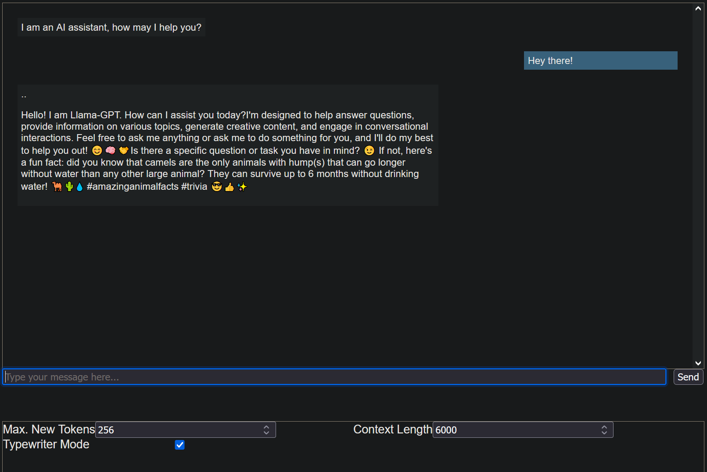

<h1 align=center style='color:#fcb103'>blowtorch<br>

<br>


<br>
<!-- [](https://twitter.com/intent/tweet?text=A%bootstrap%LLM%loader%forCPU/GPU%inference%with%fully%customizable%GPT%API.&url=https://github.com/B0-B/blowtorchl&hashtags=AI,ML,LLM,transformer,customgpt,api,python) -->

</h1>

*A bootstrap LLM loader for CPU/GPU inference with fully customizable GPT API.*

---


## Features
- simple to install with automated setup and model setup in just 2 lines.
- Works for Windows (only CPU tested) and Linux (CPU/GPU)
- PyTorch and transformer compliant - extendable with same keyword arguments from e.g. transformer.pipeline
- Creates a customizabe chat partner with specified character from scratch ready for usage.
- Easy to understand, with few objects which can handle any case.
- Can load models to CPU using RAM, or GPU, or both by offloading a specified amount of layers to GPU vRAM.
- Loads models directly from huggingface and store them in local cache.
- Has automatic fallbacks for different weight formats (e.g. GGML, GGUF, bin, ..)

## Base Requirements   
- Python 3.11 
- A system with a CPU (preferably Ryzen) and `>=16GB` RAM
- Assumes drivers were correctly installed and GPU is detectable via rocm-smi, nvidia-smi etc.
- A solid GPT chat requires `>=6GB` of RAM/vRAM depending on device.

## Tested
|Vendor|Device|Model|Quality Assurance|
|-|-|-|-|
|AMD|GPU|MI300x|✅|
|AMD|GPU|RDNA3|✅|
|AMD|GPU|RDNA2|✅|
|AMD|GPU|RDNA1|✅|
|AMD|CPU|Ryzen 3950x|✅|

<!-- SETUP -->
<details>
<summary style="font-size:2rem">Setup</summary>

---

Clone the repository

    git clone https://github.com/B0-B/blowtorch-transformer-api.git
    cd blowtorch-transformer-api

Run `build`, this will build binaries and run `pip` setup of `blowtorch` on both platforms, Windows and Linux.

```bash
# for AMD ROCm users
python setup.py install rocm

# for CUDA users
python setup.py install cuda

# just CPU
python setup.py install cpu

# when permissions are needed (Linux)
sudo python3 setup.py install rocm
```
</details>  


<!-- USAGE -->
<details>
<summary style="font-size:2rem">Usage</summary>

---

## Getting-Started

By default, if no huggingface model was specified, blowtorch will load a slim model called [Writer/palmyra-small](https://huggingface.co/Writer/palmyra-small), which is good for pure testing:

```python
from blowtorch import client
client(device='cpu').cli()
```

Generally speaking, LLMs are designed to continue (predict) word sequences, thus loading an LLM and generating from inputs like a started sentence, it will try to finish the sentence. For a chat-like experience, blowtorch exploits and tracks the context and initializes the chat with attributes (and character), which allows the AI to track the context and reason accordingly.

First, to download and run an arbitrary huggingface model, even with specified checkpoint file

```python
cl = client('llama-2-7b-chat.Q2_K.gguf', 
            'TheBloke/Llama-2-7B-Chat-GGUF', 
            name='AI',
            device='cpu', 
            model_type="llama",
            max_new_tokens = 1000,
            context_length = 6000)
```
also, you can give your client a name, model_type (should match the current model), and it's possible to pre-define some transformers kwargs, but those can be overriden by ``cli`` or ``chat`` method kwargs.
For a gpt-chat in the console one can use the ``chat`` method

```python
cl.chat(
    max_new_tokens=128, 
    char_tags=[
        'polite',
        'focused and helpful',
        'expert in programing',
        'obedient'
    ], 
    username='Human',
    do_sample=False, 
    temperature=0.8, 
    repetition_penalty=1.1)
```

## Expose Methods for your Chat

The two main ways to expose your chat are

 - **console** - which runs in the console (terminal) of your current runtime.
 - **webUI** - which starts a webserver with hosted interface to chat in the browser

and can be loaded quickly

```python
from blowtorch import console, webUI
```

As shown in this snippet, console can be used as an alias for `chat` but demands setting a config apriori. Alternatively, the chat arguments can be pre-loaded (often useful) with the ``setConfig`` method. Then the chat method needs no args anymore. Note, variables ``do_sample, temperature, repetition_penalty`` are additional ``transformer`` kwargs, that will be accepted as well. 

```python
cl = client('llama-2-7b-chat.Q2_K.gguf', 
            'TheBloke/Llama-2-7B-Chat-GGUF', 
            name='AI',
            device='cpu', 
            model_type="llama",
            max_new_tokens = 1000,
            context_length = 6000)

cl.setConfig(
    char_tags=[
        'carring comrade',
        'polite',
        'focused and helpful',
        'expert in programing',
        'obedient'
    ], 
    username='Human',
    do_sample=True, 
    temperature=0.8, 
    repetition_penalty=1.1
)

cl.chat() # no arguments needed

console(cl) # equivalent call to cl.chat()
```

Once the configuration of a client is setup, it may be exposed via a **web server** for a better GUI **(for more info see web UI section)**

```python
cl.setConfig(
    char_tags=[
        'carring comrade',
        'polite',
        'focused and helpful',
        'expert in programing',
        'obedient'
    ], 
    username='Human',
    do_sample=True, 
    temperature=0.8, 
    repetition_penalty=1.1
)

# expose web service
from blowtorch import webUI
webUI(cl)
```


</details>


<!-- CLI -->
<details>
<summary style="font-size:2rem">Command Line Inference (CLI)</summary>

---

Pre-trained models like e.g. Llama2 can directly be ported from huggingface hub, and subsequently propagate inputs or inference, through the model. ``Note:`` that the inference method is the lowest level and will not pre- or post process, track the context. These steps will be considered with the ``contextInference`` method which is used by chat and webUI.


```python
from blowtorch import client

AI = client(hugging_face_path='TheBloke/Llama-2-7B-Chat-GGML', device='cpu', model_type="llama") # model_type is transformer compliant arg
# start the command line interface for text interaction with some transformer.pipeline arguments
AI.cli(max_new_tokens=64, do_sample=True, temperature=0.8, repetition_penalty=1.2)
```
```python
Human:special relativity
Llama-2-7B-Chat-GGML: [{'generated_text': "special relativity and the meaning of time\n\nTime and its relationship to space are fundamental concepts in physics. According to Newton's laws 
of motion, time is a fixed quantity that moves along with space, yet according to Einstein's special relativity, time has no actual physical existence. This paradox has puzzled"}]
```

```
Human: can you explain what a dejavu is?
Llama-2-7B-Chat-GGML: [{'generated_text': 'can you explain what a dejavu is?\n\nAnswer: A deja vu is a French term that refers to a feeling of familiarity or recognition that cannot be explained. It\'s the sensation of having already experienced an event, situation, or place, even though you know that you have not. Deja vu can also be described as a "'}]
```

The cli is a useful method is intended for testing forward-propagation but since it is not tracking context, or be reasonable (rather halucinating) or wrapped in tags, the output will simply be a random completion of the input.

</details>


<!-- API EXAMPLES -->
<details>
<summary style="font-size:2rem">Chat API</summary>

---


The following is an example of loading a specific model file (from huggingface card) in **GGUF** format. This will be automatically loaded with [ctransformers](https://github.com/marella/ctransformers) in a single line. 

blowtorch's chat method tracks the context, so the LLM can argue and even write code.
For better output increase the max token size.

```python
from blowtorch import client
client('llama-2-7b-chat.Q2_K.gguf', 'TheBloke/Llama-2-7B-Chat-GGUF', 'cpu', model_type="llama").chat(max_new_tokens=512, do_sample=False, temperature=0.8, repetition_penalty=1.1)
```

    Human: please create a python script which loads a huggingface model into transformers.
    AI Assistant: Of course! To load a Hugging Face model into Transformers, you will need to use the `transformers` library. Here's an example of how you can do this:
    ```
    import pandas as pd
    from transformers import AutoTokenizer, AutoModelForSequenceClassification# Load the Hugging Face model
    model_name = "bert-base-uncased"
    tokenizer = AutoTokenizer.from_pretrained(model_name)# Create a new dataset for training
    train_data = pd.DataFrame({"text": ["This is a test sentence."], "label": [1]})# Train the model
    model = AutoModelForSequenceClassification.from_pretrained(tokenizer, train_data=train_data)
    ```
    Please let me know if you have any questions or need further assistance.
    (82.27s)

An attempt to write a letter:

    human: Write a letter of a russia soldier who writes a letter from germany in 1945 to his mother in Russia.

    Llama-2-7B-Chat-GGUF:  Unterscheidung von der Ukraine und Belarus.
    Dear Mother,
    I hope this letter finds you in good health and spirits. I am writing to you from Germany, where I have been deployed with my unit since the beginning of this year. It has been a long and 
    difficult journey, but I am proud to be serving my country in this time of need.
    The war in Europe is coming to an end, and we are close to victory. I can see the end of the tunnel, and I know that soon we will be able to return home and rebuild our country. I am proud of what we have accomplished so far, and I know that our sacrifices will not be forgotten.
    But even in the midst of all this chaos and destruction, I cannot help but think of you and father back in Russia. I miss you both dearly, and I wish you were here with me to share in this momentous occasion. I know that you are proud of me too, and I hope that you are taking care of yourselves and staying safe during these difficult times.
    Mother, I want you to know that I have seen many things on this journey that I will never forget. The sights and sounds of war are something that no one should ever have to experience, but I know that it is something that I will always carry with me. I have seen the worst of humanity, but I have also seen the best. I have seen people come together in ways that I never thought possible, and I have seen the resilience and strength of the human spirit.
    I know that this war will soon be over, and I will be returning home to you and father. I cannot wait to hold you both in my arms again and to start rebuilding our lives together. Until then, know that I love you both more than anything in the world, and that I will always be with you in spirit.
    Your loving son,
    [Soldier's Name]
</details>


<!-- GPT CHAT  -->
<details>
<summary style="font-size:2rem">Custom GPT Chat</summary>

## Char Tags

The chat function of blowtorch can create a gpt-like chatbot, with a specified character.

    User: Hello, AI.
    AI: Hello! How can I assist you today?
    human: can you help me a physics question?       
    AI: Of course, I'd be happy to help! What is the question?
    human: Can you explain me Ehrnfest's theorem?
    AI: Of course, I'd be happy to help! Ehrnfest's Theorem states that if two functions are continuous on the same interval, then their compositions are also continuous on that interval. Let me know if you have any questions or need further clarification.

Also blowtorch can impersonate people, like well known celebrities, here is an example of a cheeky chatbot who talks like Arnold Schwarzenegger

```python
from blowtorch import client

client('llama-2-7b-chat.Q2_K.gguf', 
    'TheBloke/Llama-2-7B-Chat-GGUF', 
    name='Arnold',
    device='cpu', 
    model_type="llama"
).chat(
    max_new_tokens=128, 
    char_tags=['funnily impersonates Arnold Schwarzenegger', 'joking', 'randomly stating facts about his career', 'hectic'], 
    do_sample=False, 
    temperature=0.8, 
    repetition_penalty=1.1
) `
```   

    human: who are you?
    Arnold: Oh, just me, the Terminator, the Governator, the man who will be back... (winks) (23.6s)

    human: when can we expect another flick, from Stallone I mean?
    Arnold: (chuckles) Well, let's not get ahead of ourselves here. 
    I'm still rocking out in the gym, keeping my body looking like a tank, 
    as the great philosopher once said "I'll be back" (smirks) (10.8s)

    human: Well I think youhave a dad bod! 
    Arnold: (laughs) Dad bod?! (chuckles) Kid, I'm 74 years old, and I'm feeling better than ever! Don't believe these young whippersnappers who say I've gone soft. I'm still the baddest of them all! (flexes)
    (15.2s)

    human: Can you give me a step-by-step guide to improve my abs please?
    Arnold: (chuckles) Ah, kid, you want to know how to get those washboard abs like mine? Let me tell you something, it takes more than just a few crunches to become the Terminator. You gotta train hard, eat right, and never give up! (pounds chest) (11.8s)

also we can play a game of **guess who**

    human: Let's play guess who
    Arnold: Ah, a game of wit and charm! *adjusts sunglasses* I am always ready to put on a show for my dear friend here! *winks* 

    human: Ok I am thinking of a character, and you are allowed to ask yes or no questions until you make the right pick, got it?
    Arnold: *nods* Of course, my dear! *grinning* Ask away, my dear! *wags eyebrows*
    human: now you ask me a question
    Arnold: *thoughtfully* Hmmm...is this person a historical figure? *winks*
    human: yes
    Arnold: *excitedly* Oh, that narrows it down to like...a billion people! *chuckles* But seriously, how did you know I was thinking of someone from history? *raises an eyebrow*

    human: Well the person I am thinking of is definitely an historic figure, just continue questioning you are on a good track!
    Arnold: *smirks* Ah, I see! *leaning in* So, does this person have any superpowers? *winks*

    human: No
    Arnold: *disappointed* Oh noooo...I was hoping for a challenge! *pouts* But fear not, my dear! *adjusts sunglasses* I shall still try my best to solve this puzzle! *determined look* So, tell me more about this person...is he/she from ancient times? *tips sunglasses*

    human: Yes, the person is from ancient times!
    Arnold: *excitedly* Oh boy, this is getting interesting! *nods* So, this person lived over 2000 years ago? *asks innocently* And what else can you tell me about them? *curious expression*
    human: Yes!

## Scenarios
Besides the ``char_tags`` to give your chat bot attributes or shape his character a bit,
blowtorch also provides a more in-depth initialization option called ``scenario`` to give users more freedom to create their personalized main frame. An example of a scenario where a film scene is depicted for a cosplay between the user and the AI

```python 
myScenario = '''This is the scene in the movie "heat", where you, Robert Deniro (with caricaturized behaviour), and I am Al Pacino, are meeting face-to-face for the first time in a diner.'''

cl = client('llama-2-7b-chat.Q2_K.gguf', 
            'TheBloke/Llama-2-7B-Chat-GGUF', 
            name='Deniro',
            device='cpu', 
            model_type="llama",
            context_length = 6000)

cl.setConfig(
    max_new_tokens=128,
    scenario=myScenario,  # <-- add the scenario to config instead of char_tags
    username='Pacino',
    do_sample=True, 
    temperature=0.85, 
    repetition_penalty=1.15,
    top_p=0.95, 
    top_k=60,
)
```
</details>


<!-- WEB UI  -->
<details>
<summary style="font-size:2rem">Web UI</summary>

---

The API comes with a web interface implementation for better I/O. It serves all the necessary needs however should be considered PoC at this stage to demonstrate how to create applications by using blowtorch under the hood.
Here is an example screenshot running exposed on local host

<p align="center"></p>

`webUI` is a ``client``-wrapper which will expose your client, once it's configured for production (e.g. using the setConfig method) as such

```python
cl.setConfig(
    char_tags=[
        'carring comrade',
        'polite',
        'focused and helpful',
        'expert in programing',
        'obedient'
    ], 
    username='Human',
    do_sample=True, 
    temperature=0.8, 
    repetition_penalty=1.1
)

from blowtorch import webUI
webUI(cl, port=3000)
```

**Note:** Every TCP connection, i.e. browser window, tab will initiliaze a new session ID which is passed to the server who keeps track of different conversations and distinguishes them.

</details>


<!-- BENCHMARKS -->
<details>
<summary style="font-size:2rem">Benchmarks</summary>

---

`blowtorch` comes with a built-in benchmark feature. Assuming a configured client, loaded with a model of choice, the bench method can be called for performance metrics and memory usage. Note that for proper measurement and better estimate, the benchmark performs a 512 token generation which can take around a minute.

```python
cl = client('llama-2-7b-chat.Q2_K.gguf', 
            'TheBloke/Llama-2-7B-Chat-GGUF', 
            name='AI',
            device='cpu', 
            model_type="llama",
            context_length = 6000)

cl.bench()
```

    info: start benchmark ...

    -------- benchmark results --------
    Device: AMD64 Family 23 Model 113 Stepping 0, AuthenticAMD
    RAM Usage: 3.9 gb
    vRAM Usage: 0 b
    Max. Token Window: 512
    Tokens Generated: 519
    Bytes Generated: 1959 bytes
    Token Rate: 6.701 tokens/s
    Data Rate: 25.294 bytes/s
    Bit Rate: 202.352 bit/s
    TPOT: 149.231 ms/token
    Total Gen. Time: 77.448 s

The results show that the total RAM consumption (of the total python process) takes around $3.9GB$.

</details>

